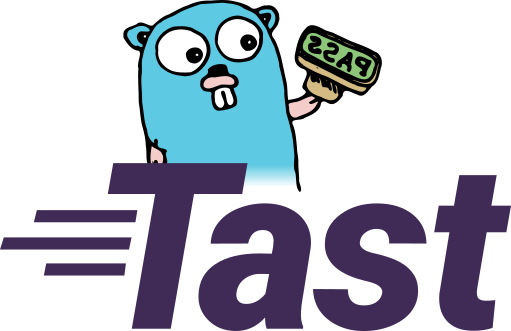

# Tast (go/tast)

Tast is an integration-testing system for Chrome OS. Its focus is on
maintainability, speed, and ease of interpreting and reproducing test results.
It supports building, deploying, and running tests. It doesn't implement other
functionality like managing labs of devices used for testing, scheduling tests,
or storing test results.

For more information, see the [list of documentation](docs/README.md).

## Directory structure

This repository is organized in accordance with the [Go in Chromium OS]
suggestions.

*   [`src/chromiumos/`](src/chromiumos/)
    *   [`cmd/local_test_runner/`](src/chromiumos/tast/cmd/local_test_runner) -
        `main` package for the `local_test_runner` executable used to execute
        local test bundles on-device.
    *   [`cmd/remote_test_runner/`](src/chromiumos/tast/cmd/remote_test_runner) -
        `main` package for the `remote_test_runner` executable used to execute
        remote test bundles on the host system.
    *   [`cmd/tast/`](src/chromiumos/tast/cmd/tast/) - `main` package for the `tast`
        executable used to build and run tests.
        *   `...` - Packages used only by the `tast` executable.
    *   [`tast/...`](src/chromiumos/tast/) - Common packages shared by multiple
        executables.

Tests are located in the [tast-tests repository].

[Go in Chromium OS]: http://www.chromium.org/chromium-os/developer-guide/go-in-chromium-os
[tast-tests repository]: https://chromium.googlesource.com/chromiumos/platform/tast-tests/

## Notes about the logo

The Go gopher concept and design was originally created by [Renee French] and is
covered by the [Creative Commons Attribution 3.0 license]. The Tast logo above
is also covered by the [Creative Commons Attribution 3.0 license].

[Renee French]: https://reneefrench.blogspot.com/
[Creative Commons Attribution 3.0 license]: https://creativecommons.org/licenses/by/3.0/
