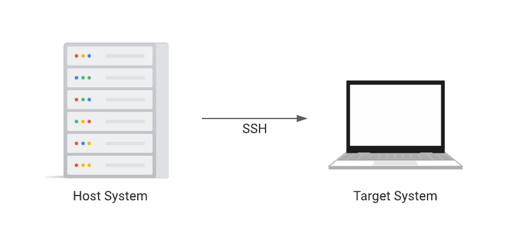
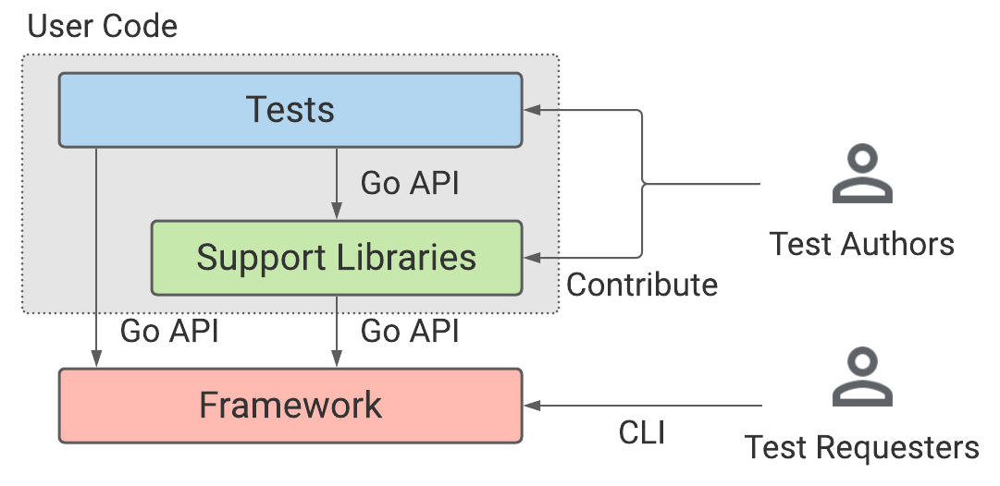
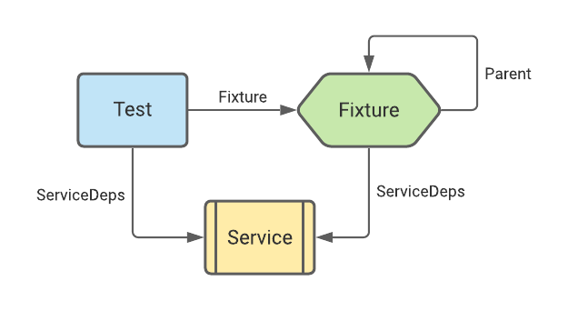
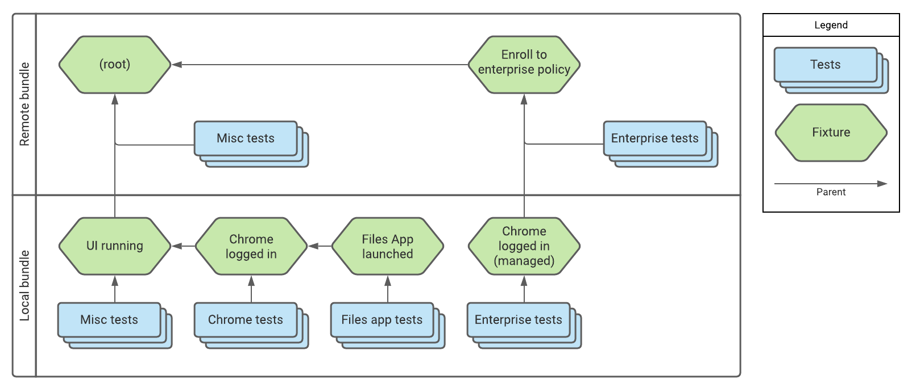
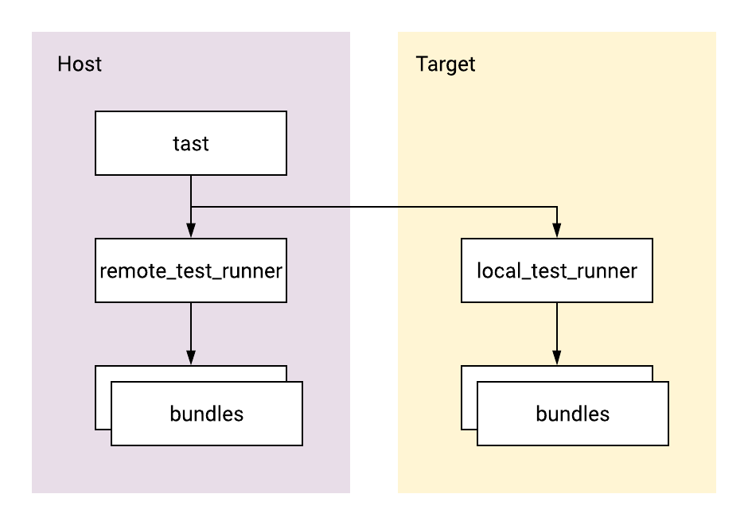

# Tast Architecture Guide (go/tast-architecture-guide)

This document describes high-level architecture of Tast framework, and provides
guidance for future enhancements to the framework.

[TOC]

## Introduction

Tast framework feature development is mostly about designing concepts. That is
because everything else in the framework, including APIs and internal
implementations, are all designed based on abstract concepts we define.
Well-designed concepts give us simple API users can easily understand, and
maintainable internal implementations. Bad concepts lead to user confusion and
maintenance nightmare.

This document was written to help you understand the current architecture of
Tast, and design new framework features.

This document first explains Tast's overall architecture and important existing
concepts. Next, it provides high-level guidance for future enhancements, citing
many examples of good/bad decisions we have made in the past. Finally, it
mentions several best practices we learned from framework development.

## Background

### Remote end-to-end testing

Tast is a remote end-to-end testing framework, primarily targeting Chrome OS.

There are two important aspects of Tast here: **end-to-end **and** remote**.
- **End-to-end**: Tast runs tests against a complete **target product**. Tests
  run in a Linux process independent from the target product, so they interact
  with the target product by simulating user inputs (e.g. generating keyboard
  events), calling into test APIs provided by the target product (e.g. Chrome
  DevTools protocol), etc.
- **Remote**: Tast involves two types of machines: a **host system** and one or
  more **target systems**. Tast tests are initiated from a host system, and
  exercise target products running on target systems remotely. Tast requires
  that target systems are reachable via SSH. Tast tests may use other extra
  means to interact with target systems, for example peripherals attached to
  a target device physically.



### Two types of Tast users

Tast has two types of users:

- **Test authors** who use Tast to write test scenarios. Test authors include
  not only authors of individual tests but also authors of support libraries
  used by multiple tests. Tast provides **Go APIs** to test authors which allows
  them to register their tests to the framework and access resources needed to
  perform test scenarios etc.
- **Test requesters** who use Tast to run test scenarios. Continuous integration
  systems configured to run Tast tests automatically are the most significant
  test requesters. Also, Test authors are considered test requesters since they
  need to run work-in-progress tests to ensure they're correct. Tast provides
  a **CLI command** to test requesters which allows them to run Tast tests and
  consume their results.

Tast stands between these two types of users. It is important to know that they
have different, or sometimes even conflicting, needs to Tast.

## Current architecture

This chapter describes the architecture of Tast framework as of writing.

### High-level structure

At a high level, Tast-related components can be largely categorized into two:
**framework** and **user code**.

- **Framework** is the engine that executes tests defined in user code.
  Framework code resides in the [chromiumos/platform/tast] repository.
  Test authors rarely make changes to the framework. This document primarily
  discusses the design of the framework.
- **User code** is a bunch of code written by test authors. User code resides
  mainly in the [chromiumos/platform/tast-tests] repository, but there are
  several other repositories such as [chromeos/platform/tast-tests-private].

User code can be further categorized into two subcategories:

- **Support libraries** are a collection of common libraries used by tests.
- **Tests** are actual test cases written by test authors.

The framework provides following APIs to users:

- Test authors: **Go APIs** to interact with the framework, including:
    - Registering entities (e.g. tests) to the framework
    - Defining a test bundle
    - Some basic libraries shared with the framework (e.g. SSH)
- Test requesters: **CLI command ("Tast CLI")** to work with tests, providing:
    - Command line flags and parameters to specify execution configuration
    - Stable protocols to report test results

The next diagram illustrates the relationship of those layers.



[chromiumos/platform/tast]: https://chromium.googlesource.com/chromiumos/platform/tast
[chromiumos/platform/tast-tests]:https://chromium.googlesource.com/chromiumos/platform/tast-tests
[chromeos/platform/tast-tests-private]: https://chrome-internal.googlesource.com/chromeos/platform/tast-tests-private

### Concepts

#### Tests

A **test** is a unit of test scenarios defined by test authors.

A test is defined in a .go file. We call such files as **test files**. A test
file must define these two functions:

1. **Test registration**: An init() function that registers a test to the
   framework on initialization.
2. **Test function**: An exported function that implements a test scenario.

Here is a complete example of a test file defining a no-op test:

```go
// File: src/chromiumos/tast/local/bundles/cros/example/pass.go

package example

import (
    "context"

    "chromiumos/tast/testing"
)

func init() {
    testing.AddTest(&testing.Test{
        Func:     Pass,
        Desc:     "Always passes",
        Contacts: []string{"nya@chromium.org", "tast-owners@google.com"},
        Attr:     []string{"group:mainline"},
    })
}

func Pass(ctx context.Context, s *testing.State) {}
```

**Test metadata** is represented by a testing.Test struct passed to
testing.AddTest on registration. Test metadata includes, but not limited to,
following fields:

- Func: A test function
- Desc: Human-readable description of a test
- Contacts: Contact emails
- Attr: Attributes assigned to a test
- Data: Data files needed by a test
- SoftwareDeps/HardwareDeps: Dependencies required to run a test
- VarDeps: Runtime variables needed by a test
- ServiceDeps: Services needed by a test

Note that test names are not included in test metadata. A test name is
automatically derived by joining a package name and a test function name with a
period. In the example above, the name of the test is "example.Pass".

When a test requester executes Tast CLI to run a test, the framework calls its
test function, passing a context.Context and a testing.State, with which it can
access resources needed for test scenario execution.

One of the most important things a test function does is to **report test
errors**. A test is considered **failed** if it reports one or more errors.
Otherwise, a test is considered **passed**. Once the framework starts a test,
its result is either passed or failed. If a test cannot be run on certain
conditions, it should describe the constraints as software/hardware dependencies
so that the framework skips it without executing it.

A test can save output files for post-run inspection. testing.State.OutDir and
testing.ContextOutDir returns a directory where a test should place output
files.

*** note
**Note**: Additional restrictions on test files

For better consistency and readability, we have a lint checker which enforces
various rules on how to define a test. Here are some notable rules:

- A test file must define exactly one test. It is prohibited to define two or
  more tests in a file.
- A test file name must match with the base name of a test. For example, a test
  named "pkg.FooBar" must be defined in pkg/foo_bar.go.
- A test file must not define any exported symbols but a test function. It can
  still optionally define other unexported symbols (constants, variables,
  functions...) that are used by the test.

These rules are designed to make it very easy to find a test file from a test name.
***

#### Local/remote

There are two types of tests: **local tests** and **remote tests**. Local tests
are executed in a process running on the target system, while remote tests are
executed in a process running on the host system.

Unless remote test functionalities are needed, a test is better to be written as
a local test. Local tests are much easier to interact with the target system as
it gets direct access to the resources on the target system (e.g. local file
system, network sockets, system calls).

There are several cases where remote tests are needed. One of the most popular
cases is a test rebooting the target system. Such a test cannot be written as a
local test since a reboot would terminate a testing process itself. Other
possible cases where remote tests are needed are: a test temporarily detaching
the target system from the network, a test controlling the target system via
peripherals attached to it, or a test interacting with multiple target systems.

Fixtures can also be local and remote. See [Fixtures](#fixtures) for details.

#### Services

A **service** is a user-defined gRPC service that can be run on the target
system to be called from remote tests and fixtures.

Remote tests have access to the target device via SSH, with which they can
interact with the target device theoretically. However it is only capable of
running external commands on the target system, so it's not enough to perform
complicated test scenarios. Instead users can implement services and call them
from remote tests by gRPC. Then remote tests can call into support libraries
built for local tests.

Services are registered to the framework in a very similar way as tests.
A service is defined in a .go file called **a service file**, containing the
following two symbols:

1. **Service registration**: An init() function that registers a service to the
   framework on initialization.
2. **Service implementation**: An exported type that implements a gRPC service.

Here is an example of a service file:

```go
// File: src/chromiumos/tast/local/bundles/cros/example/foo_service.go

func init() {
    testing.AddService(&testing.Service{
    Register: func(srv *grpc.Server, s *testing.ServiceState) {
        example.RegisterFooServiceServer(srv, &FooService{s: s})
        },
    })
}

type FooService struct {
    s *testing.ServiceState
}

func (s *FooService) Bar(ctx context.Context, req *example.BarRequest) (*example.BarResponse, error) {
    ...
}
```

**Service metadata** is represented by a testing.Service struct passed to
testing.AddService on registration.

Service methods have access to several features similar to tests. For example,
they can call testing.ContextLog to emit logs, and testing.ContextOutDir to save
output files. Those functions behave as if they're called in the remote test
calling into the current gRPC method.

Users have to declare in remote test metadata which services a remote test may
call into. This is required to build [entity graphs](#entities) before
execution.

#### Fixtures

A **fixture** sets up and maintains an **environment** to be shared by tests and
other fixtures.

An environment is an abstract term referring to a state of the target/host
system. Some possible environments a fixture may set up are, for example:

- The target Chrome OS device is in the login screen
- The target Chrome OS device is logged into a user session
- The target Chrome OS device is logged into a user session, and Crostini is
  enabled
- The target Chrome OS device is enrolled into an enterprise policy

Fixtures are registered to the framework in a very similar way as tests and
services. Fixture registration is done by an init function calling
testing.AddFixture with a testing.Fixture struct, representing fixture metadata.

Here is an example minimum fixture definition:

```go
func init() {
    testing.AddFixture(&testing.Fixture{
        Name: "someFixture",
        Impl: &someFixture{},
    })
}

type someFixture struct{}

func (*someFixture) SetUp(ctx context.Context, s *testing.FixtState) interface{} { return nil }
func (*someFixture) TearDown(ctx context.Context, s *testing.FixtState) {}
func (*someFixture) PreTest(ctx context.Context, s *testing.FixtTestState) {}
func (*someFixture) PostTest(ctx context.Context, s *testing.FixtTestState) {}
func (*someFixture) Reset(ctx context.Context) error { return nil }
```

A test can optionally **depend on** a fixture by declaring a dependency in its
metadata. If a test depends on a fixture, the fixture is used to set up a
desired environment before the test starts.

To let a fixture provide a consistent environment to tests, the framework calls
into a fixture's various **lifecycle methods**. There are 5 lifecycle methods:

- SetUp
- TearDown
- PreTest
- PostTest
- Reset

SetUp/TearDown are called when a fixture needs to set up / tear down an
environment. PreTest/PostTest are called before/after a test depending on the
fixture runs.

SetUp may return a **fixture value**, an arbitrary value that is made available
to its dependants. A fixture value value is typically used to pass in-memory
objects and/or information related to the environment the fixture has set up.

**Reset** is a unique lifecycle method called between tests depending on the
fixture. In Reset, a fixture should perform a light-weight reset of the current
environment to one acceptable by the fixture. If it fails to do so, it should
return an error, which in turn causes the framework to tear down the fixture and
set it up again before the next test. If Reset succeeds, the framework proceeds
to run the next test without tearing down the fixture. This lifecycle event
allows fixtures to efficiently recover from side effects tests left to the
environment.

For example, let us think of a fixture that provides an environment where
"logged into a Chrome user session and all windows are closed". This fixture's
lifecycle methods can be implemented in the following way:

- SetUp: Restart UI and log into a new Chrome user session, and return a Chrome
  connection object as a fixture value
- TearDown: Logout from a session and close the connection object
- PreTest/PostTest: Do nothing
- Reset: Check that the Chrome process is intact, and close all open windows

A fixture is useful for multiple tests to share an environment whose set up is
costly. For example, let us think of 10 tests needing to run test scenarios in
a Chrome user session. Without fixtures, each test needs to perform a login to
a new user session at their beginning since they don't know the current state of
the target system when they start. This is not only inefficient, but also can
elevate the risk of test flakiness as they repeat the same login operations.
This problem can be solved by introducing a fixture that logs into a new user
session, and letting 10 tests depend on the fixture. Then, when one or more
tests in the 10 tests are requested to run, the fixture is executed in advance
to log into a new user session, and tests run their test scenarios without
needing to repeat logins.

So far we explained the most basic use of fixtures. But fixtures are a powerful
mechanism with the following features:

- A fixture can be local or remote. Local fixtures run on the target system,
  while remote fixtures run on the host system.
- Fixtures are **composable**: a fixture can also optionally depend on another
  fixture. A fixture cannot depend on itself directly or indirectly.
- Furthermore, **local tests/fixtures can depend on remote fixtures**. This
  allows writing local tests that interact with the target system remotely.

See the design doc of fixtures for more information.

### Preconditions (deprecated)

Preconditions are a predecessor of fixtures. Preconditions tried to solve the
same problem in a limited way; they are not composable and have leaky boundaries
with tests.

### Entities

An **entity** is a collective term of items registered to the framework with
metadata on initialization, and called back by the framework as needed. Today,
**tests, fixtures, and services** are entities.

An entity can declare dependencies to other entities in its metadata. The
diagram below indicates which entity can depend on which entity, and which
metadata field declares them.



When a test/fixture does not depend on a fixture explicitly, the framework
treats it internally as implicitly depending on the **virtual root fixture**.

An **entity graph** is a graph having tests and fixtures as nodes and fixture
dependencies as edges. **An entity graph forms a directed tree** whose root is
the virtual root fixture. The below diagram illustrates an example entity graph.



The most important property of an entity graph is that it can be statically
computed from entity metadata. This property allows the framework to compute all
entities relevant to tests requested to run before actually executing them by
traversing an entity graph from test nodes.

*** note
**Note**: Extended entity graph

Entity graphs do not contain services. We can define an extended entity graph
containing tests, fixtures and services. An extended entity graph is not a tree
but a directed acyclic graph (DAG).
***

#### Test bundles

A **test bundle** is a Go executable file built by linking user-defined entities
and their dependencies.

A test bundle can be local or remote. Local test bundles should link local
entities only, and vice versa. A local test bundle and a remote test bundle with
the same name are grouped; entities in the same group may interact, e.g. a local
test depending on a remote fixture, or a remote test depending on a service.

A test bundle's main.go is typically a small file that anonymously imports
packages where entities are defined, and defines a main function that calls into
a framework entry point function. Below is an example main file of a local test
bundle:

```go
package main

import (
    "os"

    "chromiumos/tast/bundle"

    // Underscore-imported packages register their tests via init functions.
    _ "chromiumos/tast/local/bundles/cros/apps"
    _ "chromiumos/tast/local/bundles/cros/arc"
    ...
)

func main() {
    os.Exit(bundle.LocalDefault(bundle.Delegate{}))
}
```

bundle.LocalDefault/RemoteDefault accepts a bundle.Delegate struct which
specifies various hooks to be called by the framework. A run hook is called
before/after a test bundle is executed. A test hook is called before/after
a test is executed.

There are a few reasons to create a new test bundle. The first and foremost one
is ACL: if you want to make several tests public while keeping other tests
private, you need to create two test bundles, one for public tests and the other
one for private tests, so that external users who cannot check out private
source code can still build the public test bundle. Also, it would be useful to
create a new test bundle for a new target system (e.g. non Chrome OS target
systems) since it can install a different set of hooks.

As of writing, we have only two test bundles today: "cros" for public Chrome OS
tests and "crosint" for private Chrome OS tests. Since the two test bundles
share the same set of bundle.Delegate parameters, their main functions call into
the bundlemain support package, which in turn calls into
bundle.LocalDefault/RemoteDefault, to avoid duplication.

### Executables

Tast test execution involves three types of executables:

- **Tast CLI** a.k.a "tast" command. This is an executable installed to the host
  system in prior. Test requesters run this command, and it communicates with
  other executables to run tests. In local development environment, Tast CLI
  also invokes Go toolchains to build other executables (aka -build=true mode).
- **Local/remote test runner**. There are exactly two executables:
  "local_test_runner" installed onto the target system, and "remote_test_runner"
  installed onto the host system. They are built from solely the framework code
  and don't include any user-defined code. Tast CLI calls them to perform
  operations not specific to test bundles, and to run test bundles.
- **Local/remote test bundles**. As described above, they are executable
  containing user-defined entities.



## Guidance for future enhancements

This chapter gives guidance on framework enhancements in the future. We start
from higher-level principles and then go down to more detailed best practices.

### Key design principle

There are many design general principles for software design, and most of them
are useful for Tast framework design. That said, one of the most important
design principles I found useful specific to Tast is:

**A good framework provides a small number of orthogonal features that cover
a large number of use cases.**

It is obvious that covering more use cases is better. On the other hand, it is
good to minimize the number of features because, the more features the framework
provides, the more complexity it gets due to interaction between the features.

### Considerations on designing a new feature

#### Do you really need the feature in the framework?

On evaluating a feature request, first ask yourself if you really need it in the
framework.

As described in the key design principle, we want to minimize the number of
features the framework provides. It's best if we could support use cases without
adding new features to the framework. Check if the feature can be implemented in
support libraries or with existing framework features. If we really need
a feature in the framework, do your best to design it to cover as many use cases
as possible.

When a proposed feature is useful only for certain use cases, it may mean that
the design is too specific to those use cases. In such cases, it often helps to
punt the feature until we learn more use cases and better generalize
requirements. If feature requests are high priority, consider implementing the
feature in support libraries, even if they look unclean and/or end up in more
boilerplates.

*** aside
**Example**: Faillog

Tast has a mechanism called faillog to capture logs such as screenshots on test
failures. We initially implemented faillog as a support library
([crbug.com/856540](https://crbug.com/856540)) since we were not sure if the
feature is useful for all tests. Faillog as a support library was not optimal
as tests interested in faillog should have been modified slightly to opt-in.
After some experiments, faillog turned out to be useful for most tests, so we
merged the mechanism to the framework
([crbug.com/882729](https://crbug.com/882729)).
***

*** aside
**Example**: Screenshot tests

A proposal to extend the Tast control protocol was made for screenshot tests
([crrev.com/c/2422101](https://crrev.com/c/2422101)). After checking the
requirements, it turned out that they just wanted to run executables available
only on the host, so writing remote tests was sufficient.
***

*** aside
**Example**: -skipsort for MTBF tests

A proposal was made by MTBF test authors to add a new flag -skipsort to Tast CLI
([crrev.com/c/2429242](https://crrev.com/c/2429242)). The flag was meant to
disable Tast's internal test reordering and run tests in the exact order as
specified in command line arguments.

Supporting this feature was technically possible. However, there were no other
use cases needing this feature, and also the feature was expected to introduce
a lot of complexity to the framework. After discussion with relevant teams, we
agreed not to implement this feature.
***

*** aside
**Example**: Uploading crash dumps

A proposal was made to upload crash dumps generated during tests to Google
servers automatically ([crrev.com/c/2337754](https://crrev.com/c/2337754)).
The approach had a privacy implication since Tast has many users outside of
Google. In the end, the feature was implemented in the Chrome OS testing
infrastructure.
***

#### Interaction with other features

Think carefully how a new feature interacts with other existing features.

Enumerating interactions with existing features is a difficult task as you need
understanding of all existing features in the framework. If you're unsure, you
may want to try creating a proof-of-concept implementation of the feature, which
can uncover some interactions you couldn't imagine in advance.

*** aside
**Example**: ContextSoftwareDeps

testing.ContextSoftwareDeps is a function that returns a list of software
dependencies declared by the current test. This function was introduced to
ensure in certain support libraries that a calling test declares correct
software dependencies. An example is that chrome.New calls this function to
ensure the current test declares the "chrome" software dependency
([crbug.com/954435](https://crbug.com/954435)).

Introduction of fixtures made the function less useful since there is no
"current test" when executing fixtures. The function is planned to be deleted
([crbug.com/1135996](https://crbug.com/1135996)).

As you see from this example, you should be careful when a feature works with
"the current test".
***

*** aside
**Example**: Direct test execution with local_test_runner

Usually Tast tests are initiated by Tast CLI installed on the host system.
However, local_test_runner installed on the target system can be directly
executed by test requesters to run local tests directly. This feature was
implemented in the very early days of Tast.

Currently direct test execution with local_test_runner is deprecated since we
got several features that cannot be supported without a host system. For
example, local tests directly executed by local_test_runner cannot access secret
runtime variables as they're only installed on the host system. Also,
local_test_runner cannot execute local tests depending on remote fixtures.
***

#### Beware of versioning boundaries

Many CI systems deploy Tast for end-to-end testing, including Chrome OS, Chrome,
Android, Google3, and several other CI systems outside of Google. This means
that it is very difficult to make changes to the protocol between Tast and CI
systems, e.g. adding/removing/changing Tast CLI flags or changing test result
directory structure, since you cannot make atomic commits to Tast and all those
CI systems.

In general, we should be extremely careful about designing a new Tast CLI
feature for test requesters since it is difficult to make breaking changes.
As for Go APIs for test authors, we can be less strict as we can make atomic
commits to the framework and user code as of writing. However, once we start
having Tast tests outside of Chrome OS repositories, Go API stability will
become important.

*** aside
**Example**: Introducing group:mainline

In the early days of Tast, we had only three classifications of a test:
critical, informational, and disabled. The classification rule was simple:
a test is,
- disabled if it has the "disabled" attribute,
- informational if it has the "informational" attribute,
- critical otherwise.

After introducing non-functional tests (e.g. performance tests), we introduced
test group attributes. In the new rule, a test needed the "group:mainline"
attribute to be considered as critical/informational. To disable a test, simply
the "group:mainline" attribute could be removed.

Migration from the old rule to the new rule turned out to be very painful
because those rules have been hard-coded to several CI systems (Chrome OS,
Chrome, Android at that time) as attribute expressions. Therefore we needed to
do step-by-step migration as described in
[go/tast-mainline-attr-transition](https://goto.google.com/tast-mainline-attr-transition).
***

*** aside
**Example**: Test selection by software dependencies

We had a bug where ARC-related tests were run in an unexpected way
([crbug.com/992303](https://crbug.com/992303)). The root cause was that
ARC-related software dependency names were renamed
(e.g. "android" -> "android_p") while we continued to use the old software
dependency name to select ARC-related tests ("dep:android").

A lesson learned is that user-defined test metadata should not be directly
referenceable in attribute expressions. This is a problem we have to resolve
in the future.
***

*** aside
**Example**: Using new Tast CLI flags

We had a bug that Tast CLI fails to run because of unsupported flags on release
branches ([b/191779650](https://issuetracker.google.com/issues/191779650)).
It was because a new flag was added to Tast CLI but Chrome OS CI used an
unbranched config to specify a list of flags to pass to Tast CLI.

We think that this is a design bug in Chrome OS CI configuration: unbranched CI
configs should not construct Tast CLI flags that can change per branch. We
expect that this problem is solved in the future.
***

#### Beware of Chrome OS specific logic

Tast framework should focus on being a general remote testing framework, and
should be agnostic to the target/host system type.

Tast started as a testing framework for Chrome OS, so naturally it has several
hard-coded logic that assume that the target system is Chrome OS and the host
system is Chrome OS chroot. But we expect that Tast will be used outside of
Chrome OS in near future. Therefore it is good to avoid introducing new
Chrome OS specific logic to the framework, and remove existing Chrome OS
specific logic from the framework.

If you need Chrome OS specific logic, consider if you can put them in test
bundles or CI systems. If it's impossible, introduce a proper boundary between
the new Chrome OS specific logic and existing OS agnostic logic.

*** aside
**Example**: Test hooks

A proposal was made to the framework to run the auditctl command between tests
for debugging certain failures
([crrev.com/c/2513678](https://crrev.com/c/2513678)). Since this logic was
specific to Chrome OS, we introduced test hooks to test bundles and asked the
author to put the logic there.
***

*** aside
**Example**: Chrome OS infra specific APIs

For next-gen Chrome OS infra support, we added to the framework the logic to
resolve the target hostname and port with Chrome OS infra specific APIs. This
design turned out bad, and we're moving the logic out of the framework.
***

*** aside
**Example**: Downloading external data files

In Chrome OS lab, when downloading data files from Google Cloud Storage, test
frameworks (not limited to Tast) are supposed to use Devservers, which act as
a sort of caching proxy server to Google Cloud Storage with private credentials.
Tast uses Devservers to download external data files needed by tests.

Test frameworks and Devservers use non-standard REST APIs to communicate.
Today, many non-Chrome OS infra run Tast tests, but it is only Chrome OS infra
that provides Devservers to Tast to allow downloading ACL'ed external data
files.

In near future we should replace Devserver protocol support in Tast.
***
