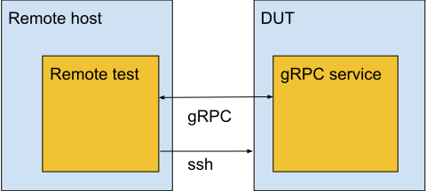

# Tast Codelab: Remote tests (go/tast-codelab-4)

> This document assumes that you've already gone through [Codelab #1].

This codelab follows the creation of a remote Tast test and a [gRPC](https://grpc.io) service
used by the test.

[Codelab #1]: codelab_1.md


## Background

In Tast our reference point is the DUT, so anything not running on the DUT is
considered to be remote in the Tast context. So remote tests are tests which do
not run on the DUT itself but on a remote host. They are needed when a test
needs to reboot the DUT during the test execution for any reason. Alternatively
a remote fixture can be used when reboots are only needed in a preparation step
for the test (e.g. enrollment, resetting hardware etc.). The remote host can
communicate with the DUT via ssh or gRPC services during the test, which are
used to execute code on the DUT itself.



Unless ssh calls are enough for the test, the remote test will consist of two
parts:

  1. The remote part which includes all the initialization steps and calls to
    gRPC services.
  2. One or more gRPC services which execute the required code on
    the DUT, e.g. for login, the general test logic and cleaning up the DUT.


## gRPC services

The gRPC services are created using [protocol buffers](https://developers.google.com/protocol-buffers)
to define their signatures, their respective request and response message types.
We create a proto file with the definition in the folder in
`tast-tests/src/chromiumos/tast/services/cros` that corresponds to the test.
So if you need a service for a policy test the folder used will be `policy`.
In this example we will create a service with a method that checks if the
timezone set on the DUT matches a given timezone. So we need one method
`TestSystemTimezone()` which performs the check. The request message type for
the method will be `TestSystemTimezoneRequest` and contains a timezone string.
As the method doesn't return anything except for an error when it fails the
response message type is `google.protobuf.Empty`.
As `option` we will also define a `go_package` of which this service should be
part of.

```
syntax = "proto3";

package tast.cros.policy;

import "google/protobuf/empty.proto";

option go_package = "chromiumos/tast/services/cros/policy";

// SystemTimezoneService provides a function to test the system timezone.
service SystemTimezoneService {
  rpc TestSystemTimezone(TestSystemTimezoneRequest) returns (google.protobuf.Empty) {}
}

message TestSystemTimezoneRequest {
  string Timezone = 1;
}
```

In order to generate the go code for this service we add its proto file to the
`gen.go` file in the same folder.

```go
// Package policy provides the PolicyService
package policy

// Run the following command in CrOS chroot to regenerate protocol buffer bindings:
//
// ~/trunk/src/platform/tast/tools/go.sh generate chromiumos/tast/services/cros/policy
//go:generate protoc -I . --go_out=plugins=grpc:../../../../.. system_timezone.proto
```

Then we run
`~/trunk/src/platform/tast/tools/go.sh generate chromiumos/tast/services/cros/folder`
as stated in the `gen.go` file. This will generate a `system_timezone.pb.go` file
which contains the go code for the service.

NOTE: When committing a remote test with gRPC services, make sure to also submit the
generated files.

## Local service implementation

Next we need to implement what the `TestSystemTimezone` method is actually
doing on the DUT. The service implementation is placed in the same folder as
respective local tests. So again if you are writing a remote policy test, all
created services for that test go in the
`src/chromiumos/tast/local/bundles/cros/policy` folder.

For the implementation we need to import the respective package we assigned
our service to as well as the `grpc` package. As we use an empty response
in our service we also need the `protobuf/ptypes/empty` package.

```go
import (
	...
	"github.com/golang/protobuf/ptypes/empty"
	"google.golang.org/grpc"

	pb "chromiumos/tast/services/cros/policy"
	...
)
```

In the `init()` function we only add a service instead of a test:

```go
func init() {
	testing.AddService(&testing.Service{
		Register: func(srv *grpc.Server, s *testing.ServiceState) {
			pb.RegisterSystemTimezoneServiceServer(srv, &SystemTimezoneService{s: s})
		},
	})
}
```

Then we need a struct to hold our service:

```go
// SystemTimezoneService implements tast.cros.policy.SystemTimezoneService.
type SystemTimezoneService struct {
	s *testing.ServiceState
}
```

And finally we need an implementation for all methods defined in our service.
All methods return their respective response message and an error as second
return value which needs to be checked by the caller.
In this case this is just the `TestSystemTimezone()` method which returns
a reference to `empty.Empty{}` and an error if the check fails.
These methods are the part of the remote test that get executed on the DUT,
so we can put most of our test logic in these:

```go
func (c *SystemTimezoneService) TestSystemTimezone(ctx context.Context, req *pb.TestSystemTimezoneRequest) (*empty.Empty, error) {

	if err := upstart.RestartJob(ctx, "ui"); err != nil {
		return nil, errors.Wrap(err, "failed to log out")
	}

	// Wait until the timezone is set.
	if err := testing.Poll(ctx, func(ctx context.Context) error {

		out, err := os.Readlink("/var/lib/timezone/localtime")
		if err != nil {
			return errors.Wrap(err, "failed to get the timezone")
		}
		outStr := strings.TrimSpace(string(out))

		if !strings.Contains(outStr, req.Timezone) {
			return errors.Errorf("unexpected timezone: got %q; want %q", outStr, req.Timezone)
		}

		return nil

	}, &testing.PollOptions{
		Timeout: 30 * time.Second,
	}); err != nil {
		return nil, err
	}

	return &empty.Empty{}, nil
}
```

In this example the `TestSystemTimezone()` method will poll the currently set
timezone on the console and compare it to the timezone in the input parameter.
The function always returns a reference to `empty.Empty{}` as request response
and when the timezones don't match until the polling timeout is reached it
also returns an error. The error indicates that the timezone on the DUT is not
the expected timezone.

The full implementation of the local service can be found
[here](https://osscs.corp.google.com/chromiumos/chromiumos/codesearch/+/03b1d8d64180a8e6f5c073c683cd3ba070adf1f8:src/platform/tast-tests/src/chromiumos/tast/local/bundles/cros/policy/system_timezone_service.go)

## Remote test

The remote tests themselves are put into their respective folder in
`tast-tests/src/chromiumos/tast/remote/bundles/cros`, so in the case of a policy test they are placed in
`tast-tests/src/chromiumos/tast/remote/bundles/cros/policy`.
With the generated service we can now implement the remote part of the test.
For that we import all packages containing services we need as well as the
`rpc` package. For tests involving enrollment we also need the
`remote/policyutil` package to power wash the device.

```go
import (
	...
        "chromiumos/tast/remote/policyutil"
	"chromiumos/tast/rpc"
	ps "chromiumos/tast/services/cros/policy"
	...
)
```

In the `init()` function we add the services we want to use as `ServiceDeps`.
If the test performs an enrollment then we also add it to the enrollment group.

```go
func init() {
	testing.AddTest(&testing.Test{
		Func: SystemTimezone,
		Desc: "Just getting the time in a certain timezone",
		Contacts: []string{
			"googler@google.com", // Test author
			"googler-team@google.com",
		},
		Attr:         []string{"group:enrollment"},
		SoftwareDeps: []string{"chrome"},
		ServiceDeps:  []string{"tast.cros.policy.PolicyService", "tast.cros.policy.SystemTimezoneService"},
		Timeout:      7 * time.Minute,
	})
}
```

In the test function we then establish a gRPC connection to the DUT. We
create a client instance of our service on the connection and then we can call
the methods of the service.

```go
func SystemTimezone(ctx context.Context, s *testing.State) {
	...

	// Establish RPC connection to the DUT.
	cl, err := rpc.Dial(ctx, s.DUT(), s.RPCHint())
	if err != nil {
		s.Fatal("Failed to connect to the RPC service on the DUT: ", err)
	}
	defer cl.Close(ctx)

	// Create client instance of the SystemTimezone service.
	psc := ps.NewSystemTimezoneServiceClient(cl.Conn)

	// Use the TestSystemTimezone method of the SystemTimezone service
	// to check if the timezone was set correctly by the policy.
	if _, err = psc.TestSystemTimezone(ctx, &ps.TestSystemTimezoneRequest{
		Timezone: "Europe/Berlin",
	}); err != nil {
		s.Error("Failed to set SystemTimezone policy : ", err)
	}
```

The full implementation of the remote test can be found
[here](https://osscs.corp.google.com/chromiumos/chromiumos/codesearch/+/03b1d8d64180a8e6f5c073c683cd3ba070adf1f8:src/platform/tast-tests/src/chromiumos/tast/remote/bundles/cros/policy/system_timezone.go).
