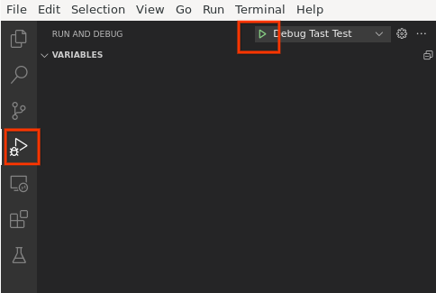

# Tast: Debugging tests with a debugger (go/debug-tast-tests)

[TOC]

## Prerequisites

* Have VScode installed
* Able to run a tast test ([running tests](running_tests.md))
* Access to a DUT.

## Step 1: Confirm that your DUT can run delve

SSH into your DUT and run “dlv” on it. If it doesn't work, delve likely isn't supported for your DUT, and you can try two things:
* Try running `emerge-${BOARD} dev-go/delve && cros deploy dut dev-go/delve`
* Try installing the 64-bit version of your image (eg. atlas64 instead of atlas). Delve is unsupported for arm32 ([github bug](http://github.com/go-delve/delve/issues/2051))..

## Step 2: Install the debugger on your host machine (outside the chroot)
Instructions to install delve are [here](https://github.com/go-delve/delve/blob/HEAD/Documentation/installation/README.md), but TLDR is:
```
$ git clone https://github.com/go-delve/delve
$ cd delve
$ go install github.com/go-delve/delve/cmd/dlv
$ rm -rf ../delve
```

## Step 3: Check that the debugger is working
1) In your chroot, run `tast run -attachdebugger=local:2345 <DUT ip> meta.LocalPass`

2) Wait for it to say “Waiting for debugger on port 2345”.

3) Outside, the chroot, run `dlv connect :2345`

4) Once you see (dlv) prompt, type "c" (without quotes) and press enter.

5) Check that the tast command completed successfully

Note that people have had issues with vscode’s SSH extension with this. If this failed with vscode with the SSH extension open, then close vscode and try again.

## Step 4: Ensure you have a working gopath
If you haven't already, follow the instructions in the [quickstart guide](quickstart.md#ide) to get your gopath working

## Step 5: Set up vscode
1) Open up the folder `$CHROMEOS_SRC/src/platform/tast-tests` in vscode (or reload vscode if it’s already open)

2) If you don’t have a tasks.json, press control-shift-p, then select the option “tasks: configure task” -> “create tasks.json file from template”, select any template, then delete all of your tasks it created for you.

3) If you don't have a launch.json, click Run -> Add configuration -> select any configuration, then delete the configuration it created for you.

4) Replace tasks.json with the following (or if you already had useful tasks, merge the files). Make sure to swap out DUT_IP for your own DUT’s IP
```
{
  // See https://go.microsoft.com/fwlink/?LinkId=733558
  // for the documentation about the tasks.json format
  "version": "2.0.0",
  "tasks": [
    {
      "label": "prep debugger",
      "type": "shell",
      "command": "cros_sdk -- /mnt/host/source/src/platform/tast-tests/tools/run_debugger.py --dut=DUT_IP --current-file=${file}",
      "isBackground": true,
      "problemMatcher": [
        {
          "owner": "tast",
          "fileLocation": [
            "relative",
            "${workspaceFolder}/src/platform"
          ],
          "pattern": {
            // 2021/01/20 11:53:25 ../platform/tast-tests/src/go.chromium.org/tast-tests/cros/local/bundlemain/main.go:274:3: unknown field 'BeforeDownload' in struct literal of type "chromiumos/tast/internal/bundle".LocalDelegate
            // ../platform/tast-tests/src/go.chromium.org/tast-tests/cros/common/perf/timeline_test.go:217:51: cannot use d1 (type *testTimelineDatasource) as type TimelineDatasource in array or slice literal:
            "regexp": "(..\/platform\/[^:]+):(\\d+):(\\d+):\\s+(.+)$",
            "file": 1,
            "line": 2,
            "column": 3,
            // "severity": 2,
            "message": 4
          },
          "background": {
            "activeOnStart": true,
            "beginsPattern": ".*",
            "endsPattern": ".*Waiting for debugger on port.*",
          }
        }
      ],
    }
  ]
}
```

5) Replace launch.json with the following (or if you already had useful configurations, merge the files).
```
{
  // Use IntelliSense to learn about possible attributes.
  // Hover to view descriptions of existing attributes.
  // For more information, visit: https://go.microsoft.com/fwlink/?linkid=830387
  "version": "0.2.0",
    "configurations": [
    {
        "name": "Debug tast test",
        "type": "go",
        "request": "attach",
        "mode": "remote",
        "remotePath": "",
        "port": 2345,
        "host": "127.0.0.1",
        "apiVersion": 2,
        "preLaunchTask": "prep debugger"
    },
  ]
}
```

## Step 6: Try it out
1) Open a test file

2) Add a breakpoint at the start of your test

3) Click on the debug button in vscode


